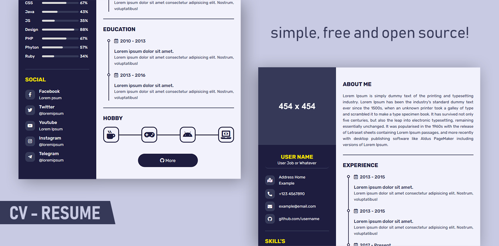

<h1 align="center">Template based HTML and CSS</h1>

    

<h3 align="center"><strong>This is a template simple for CV or Resume based HTML and CSS, simple and free.</strong></h3>

 

# Usage
- To get started **PLEASE DON'T FORK** just `Use this template` or direct link **[here](https://github.com/0x5df/cv-template/generate)**.
- Edit with any Text Editor, Highly recommended to use [Visual Studio Code](https://code.visualstudio.com/).

# Donate
- <h3 align="left"><a href="https://www.paypal.com/paypalme/kybo15">PayPal</a></h3>

# Thanks
- Thank [Font Awesome 5](https://fontawesome.com/icons?d=gallery) for the free icons
